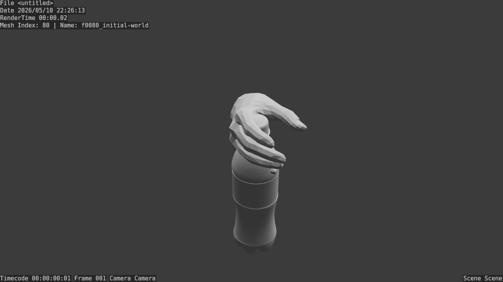
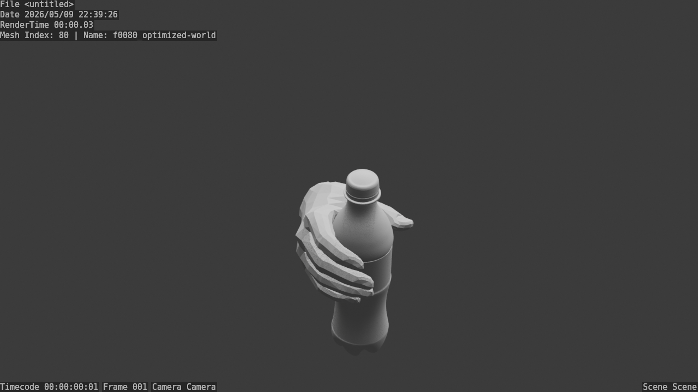
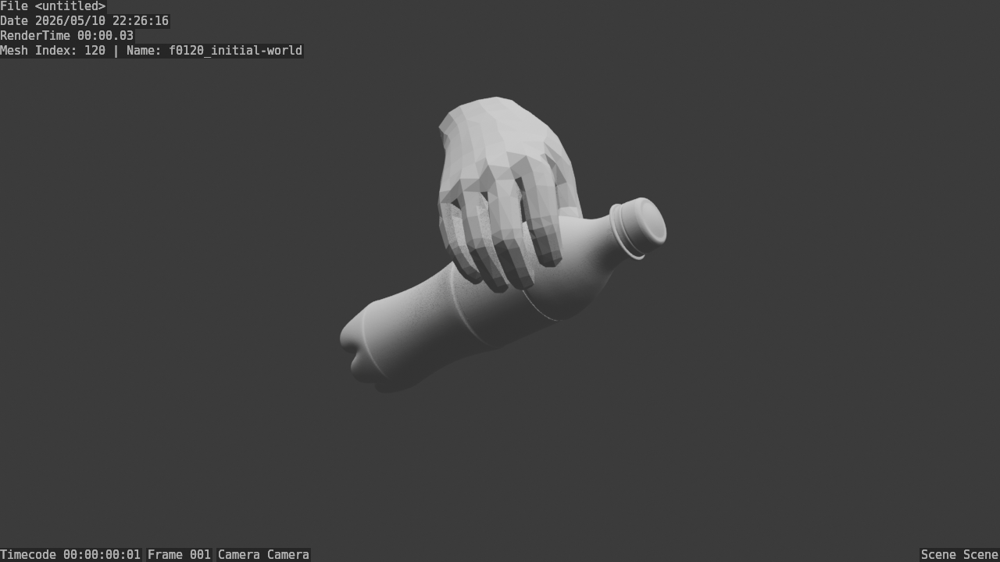
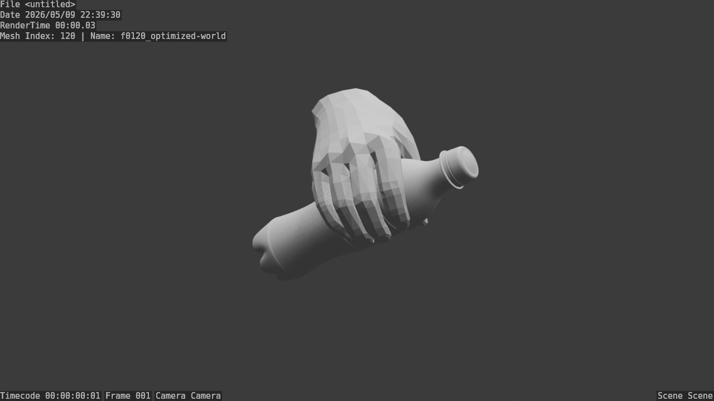
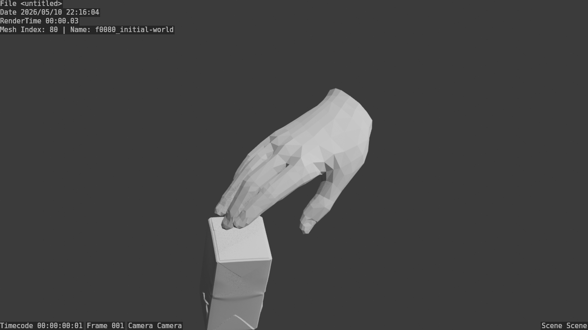
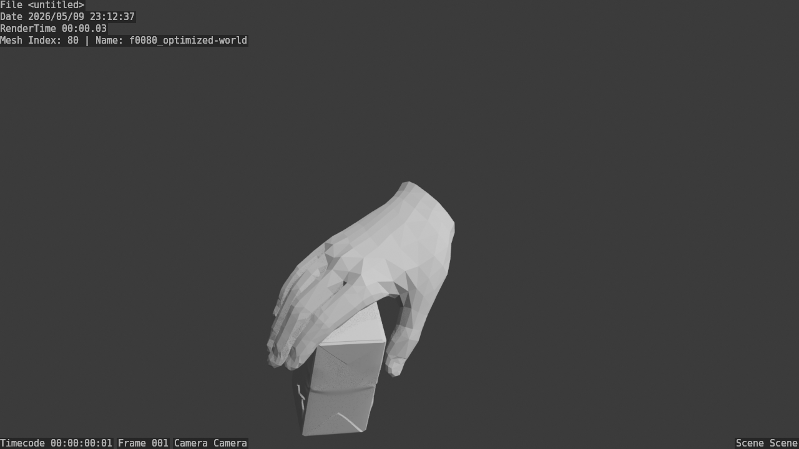
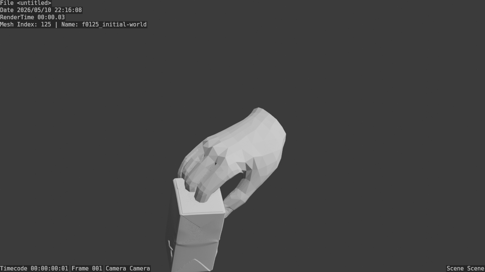
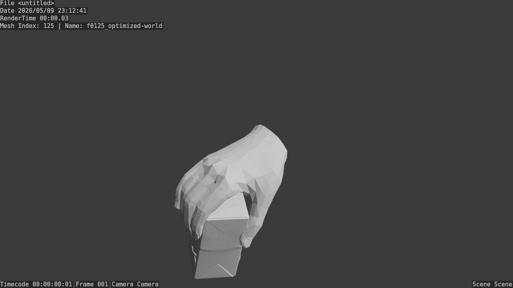

# HOI Optimization Demo

A repository contains HOI-optimization-demo. The hoi(hand object interaction) optimization pipeline is a part of [Robowheel(CVPR 2026)](https://zhangyuhong01.github.io/Robowheel), which improves contact plausibility, reducing penetration, and refining hand-object alignment.

## Overview

## Visualization

### Demo 1: pour cola

| * | before optimization | after optimization |
| --- | --- | --- |
| frame 80 |  |  |
| frame 120 |  |  |

whole sequences:

| before optimization | after optimization |
| --- | --- |
|  |  |

### Demo 2: pick-up milk

| * | before optimization | after optimization |
| --- | --- | --- |
| frame 80 |  |  |
| frame 125 |  |  |

whole sequences:

| before optimization | after optimization |
| --- | --- |
|  |  |

## Citation

If you find this repository relevant, please also refer to and cite the broader RoboWheel project:

```bibtex
@article{zhang2025robowheel,
  title={RoboWheel: A Data Engine from Real-World Human Demonstrations for Cross-Embodiment Robotic Learning},
  author={Zhang, Yuhong and others},
  journal={arXiv preprint arXiv:2512.02729},
  year={2025}
}
```

## Contact

Email: lnykyks@gmail.com
